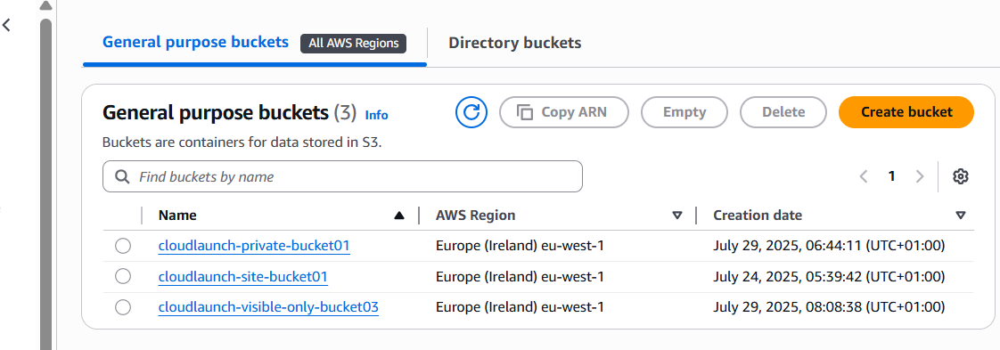
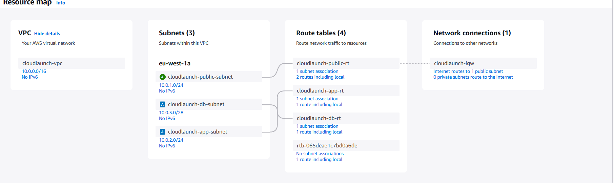
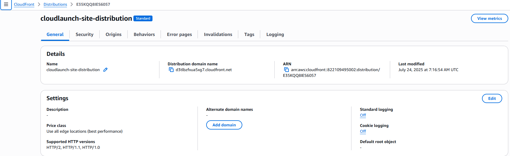
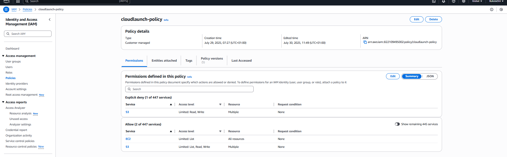
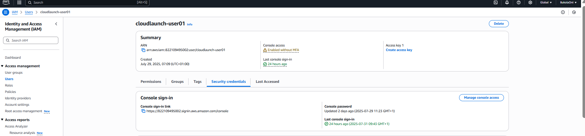

#  Product Concept:CloudLaunch Altschool-Month1-Assessment

This project demonstrates AWS fundamentals by setting up a **mini cloud environment** for a product called **CloudLaunch**.  

It covers:
- ✅ Hosting a static website on Amazon S3 with CloudFronts for HTTPS and   caching
- ✅ Implementing strict IAM policies for secure s3 access
- ✅ Designing a custom VPC with public, application, and database subnets

----
## 📌 Task 1 - Static Website Hosting (S3 + IAM)
-Created **3 S3 buckets**:
- 1️⃣ `cloudlaunch-site-bucket01` -Hosts the static website (public, read only)
- 2️⃣ `cloudlaunch-private-bucket01` - Private storage (IAM user can **GetObject/PutObject**)
- 3️⃣`cloudlaunch-visible-only-bucket03` - User can list but not access content

- Configured **IAM user (cloudlaunch-user)** with a custom JSON policy:
  - ✅ Read-only on site bucket
  - ✅ Get/Put on private bucket
  - ✅ No delete permissions
  - ✅ No access to contents of visible-only bucket

-Enabled **CloudFront distirbution** for HTTPS and global caching  
- 🔗 **S3 Website URL:** [Visit Site](http://cloudlaunch-site-bucket01.s3-website-eu-west-1.amazonaws.com/)  
- 🔗 **CloudFront URL:**[Visit via CloudFront](https://d3tlbzfxua5xg7.cloudfront.net/)

---
## 📌 Task 2 - VPC Design
- Created a **VPC (cloudlaunch-vpc)** with CIDR block `10.0.0.0/16`.
- Created **3 subnets**
   - Public Subnet `10.0.1.0./24`
   - App Subnet `10.0.2.0/24`
   - DB Subnet `10.0.3.0/28`

- Created and attached **Internet Gateway**.
- Configured **Route Tables**:
 -  Public subnet route table ➡️Routes to Internet Gateway (0.0.0.0/0).
 -  App and DB route tables ➡️ No internet routes (fully private).  

- Created  **Security Groups**:
  - `cloudlaunch-app-sg` ➡️ Allows HTTP (port 80) only within VPC.
  - `cloudlaunch-db-sg` ➡️ Allows MySQL (port 3306) access **from app subnet only**.

- Updated IAM policy to give **Describe** permisions for VPC components

##📄IAM Policy
[See iam-policy.json](./iam-policy.json)

## 📂 Repository Structure
```
Altschool-month1-Assessment/
├── assets/ # Images and CSS for the static website
├── index.html # Static website homepage
├── screenshots/ # Screenshots of S3, VPC, CloudFront, IAM
├── iam-policy.json # IAM policy attached to cloudlaunch-user
└── README.md # Project documentation
```
## 📸 Screenshots
Below are key resources created during the assignment:
| S3 Buckets | VPC Resource Map | CloudFront | IAM Policy | IAM User |
|------------|------------------|------------|------------|----------|
|  |  |  |  |  |

---

## 🛠️ AWS Services Used
- **Amazon S3** – Hosts a static website and private storage  
- **Amazon CloudFront** – Provides HTTPS, global caching and faster content     delivery  
- **AWS IAM** –Manage user access with strict least-privilege policies  
- **Amazon VPC** – Creates a custom network with public, app and subnets, route tables, and security groups  

---


Bukola Oni – AltSchool Cloud Engineering Student 🚀
